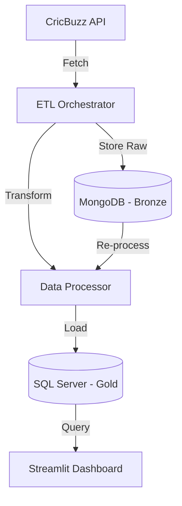

# 🏏 CricHub: Advanced Cricket Analytics Pipeline


CricHub is a production-grade Cricket Analytics platform that automates the collection, transformation, and visualization of cricket data. It features a robust ETL pipeline that fetches real-time data from the CricBuzz API, stores it in a Bronze (MongoDB) layer for raw data preservation, and then processes it into a Gold (SQL Server) layer for high-performance analytical queries.

## 🚀 Key Features

*   **Automated ETL Pipeline**: Fetches live match data, scorecards, and player stats automatically.
*   **Dual-Layer Storage**: 
    *   **Bronze Layer (MongoDB)**: Stores raw JSON responses for historical auditing and re-processing.
    *   **Gold Layer (SQL Server)**: Structured relational schema optimized for complex analytical queries.
*   **Intelligent Backfill**: Handles missing historical data with automated backfill logic.
*   **Interactive Dashboard**: A premium Streamlit-based dashboard for visualizing match insights, player performance, and series records.
*   **SQL Analytics Engine**: Pre-built views and queries for deep-dive performance analysis.

## 🏗️ Architecture



## 🛠️ Setup Instructions

### 1. Prerequisites
*   Python 3.9+
*   MongoDB (Local or Atlas)
*   SQL Server (Express or Standard)
*   CricBuzz API Key (via RapidAPI)

### 2. Environment Configuration
Clone the repository and create a `.env` file based on the provided template:

```bash
cp .env.example .env
```

Edit `.env` with your actual credentials:
*   `RAPIDAPI_KEY`: Your RapidAPI key.
*   `MONGO_URI`: Your MongoDB connection string.
*   `SQL_SERVER`: Your SQL Server instance name.

### 3. Install Dependencies
```bash
pip install -r requirements.txt
```

### 4. Database Initialization
The pipeline will automatically initialize the SQL database and required tables on its first run, but you can also run the provided SQL script:
```bash
sqlcmd -S YOUR_SERVER -i cricket_practice_queries.sql
```

## 🏃 How to Run

### Start the ETL Pipeline
You can run the orchestrator once or leave it running as a scheduler (defaults to every 6 hours):

```bash
# Run once now
python main.py --now

# Run as a scheduler
python main.py
```

### Launch the Dashboard
```bash
streamlit run dashboard/app.py
```

## 📂 Project Structure

*   `api/`: CricBuzz API integration logic.
*   `config/`: Configuration management using environment variables.
*   `dashboard/`: Streamlit application files (pages, components, assets).
*   `database/`: Database connection handlers (Mongo & SQL).
*   `etl/`: Core ETL logic (Orchestration, Transformation, Backfill).
*   `scripts/`: Utility scripts for data auditing and maintenance.
*   `scratch/`: Development experiments and one-off migration scripts.

## 📜 License
This project is for educational and personal use. Please refer to API terms of service when using CricBuzz data.
